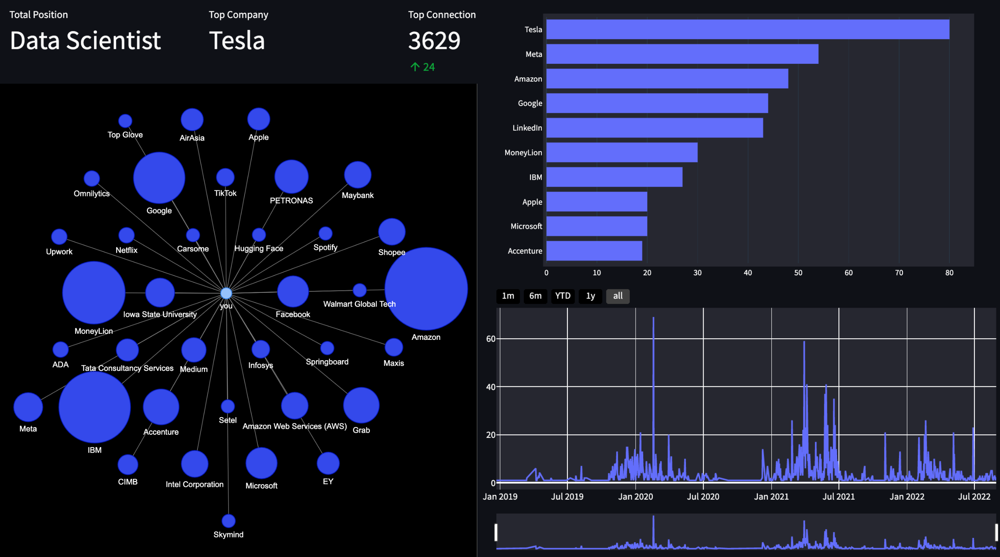
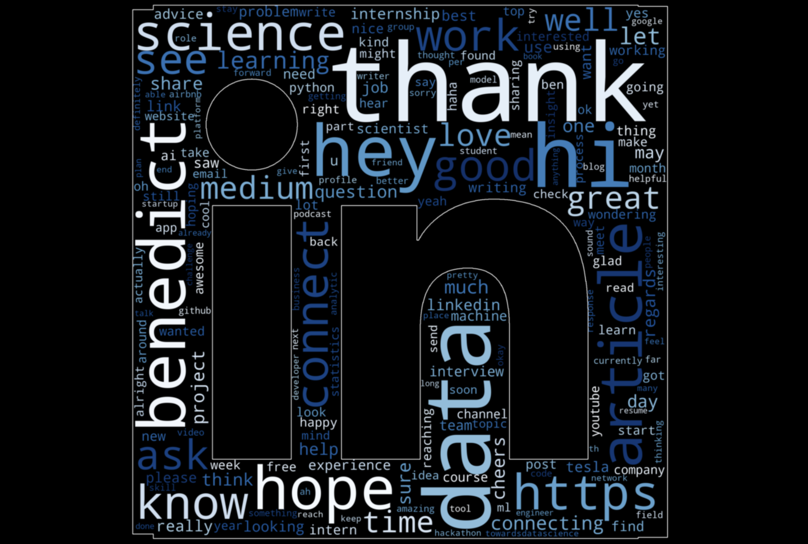
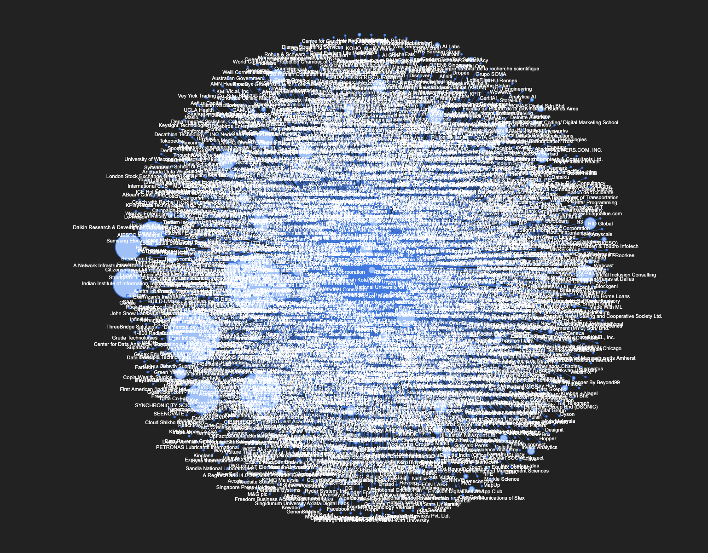

# Linkedin Connections Insights 🪄

[](https://share.streamlit.io/benthecoder/linkedin-visualizer/main/app.py)

Get helpful statistics on your LinkedIn connection now!

Read this article to know more about this project: [Visualize your LinkedIn Network with Python](https://medium.com/bitgrit-data-science-publication/visualize-your-linkedin-network-with-python-59a213786c4)



## Features

This app tells you the information below

- Total connections on LinkedIn
- Where most of your connections work at
- Who most of your connections are (what job title they hold)
- Who you last connected with
- Who you first connected with (send them a message!)
- Bar chart of top companies and positions
- Time series plot of your connections over time (find out when you had the most connections)
- A graph/network of your connections (see your connections in a graph)
- A wordcloud of your chat messages with your connections _(new!)_
- Last but not least, a "who you can cold email" section that provides a list of emails of your connections (perks of LinkedIn connections!)

[Use it now!](https://share.streamlit.io/benthecoder/linkedin-visualizer/main/app.py)

## Word Cloud (New Feature!)



## Run Locally

Clone the project

```bash
  git clone https://github.com/benthecoder/linkedin-visualizer.git
```

Go to the project directory

```bash
  cd linkedin-visualizer
```

### Using Docker

Build an Image

```
docker build -t linkedin-visualizer:1.0 .
```

Run the Image

```
docker run -p 8501:8501 linkedin-visualizer:1.0
```

The app is now live on http://localhost:8501/

### Using Conda

Create Conda environment

```bash
  conda create --name env_name python=3.8
```

Activate the environment

```bash
  conda activate env_name
```

Install requirements

```bash
  pip install -r requirements.txt
```

Run streamlit

```bash
  streamlit run app.py
```

## Contributing

Contributions are always welcome!

## All connections

Here's what happens when I display all of the companies where my connections work at


