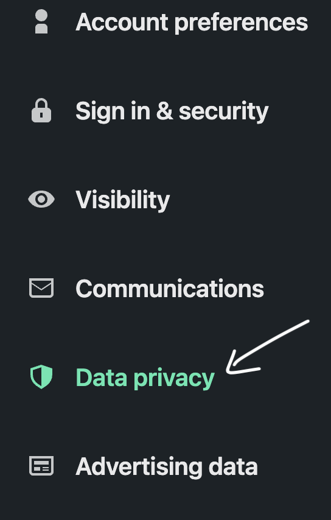
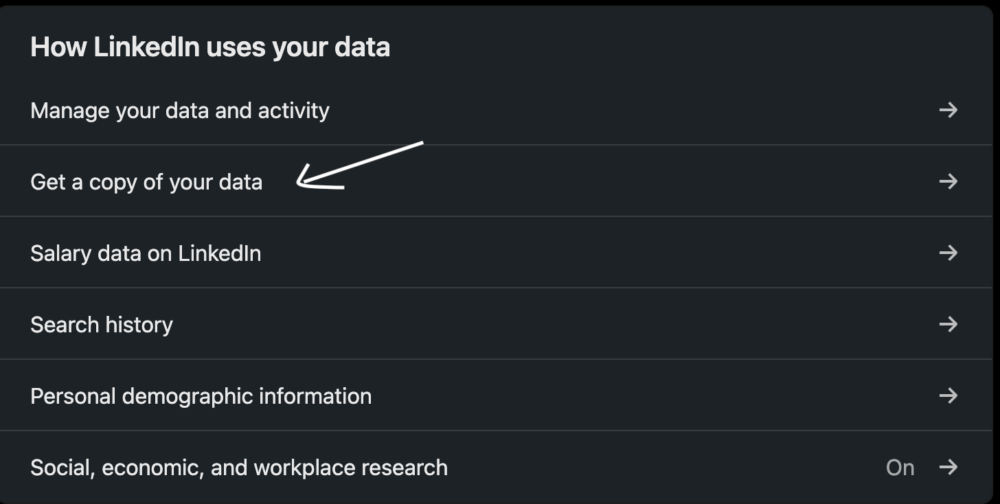

## How to get the data?

First head over to the home page and click on your profile image

Click on the settings

Head to the data privacy tab

Find "Get a copy of your data"

Click on download larger data archive

Click request archive and type your LinkedIn password

Now just wait a few minutes and the archive will arrive to your mail!

Once you get the data, just drag it to the file uploader and enjoy the insights :)
